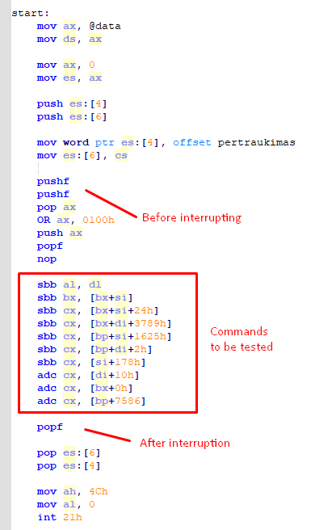
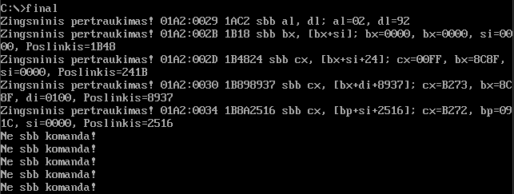

# Platformer game

This is an ***Interruptor for sbb commands*** made in Assembly-8086 using *TASM*. It was created during Computer Architecture course during the first semester of **Software Engineering (2022)** as the final project for this course.

## It includes the following features:
 * Checking if the command is sbb (subtract with borrow);
 * Finding the address in memory where the interrupt occured;
 * Finding the opcode and operands in the memory;

## Run:
```
tasm final.asm
tlink final.obj
final
```

## Examples:
 </br>
*final.asm tested commands* </br>

 </br>
*Examples after execution* </br>
